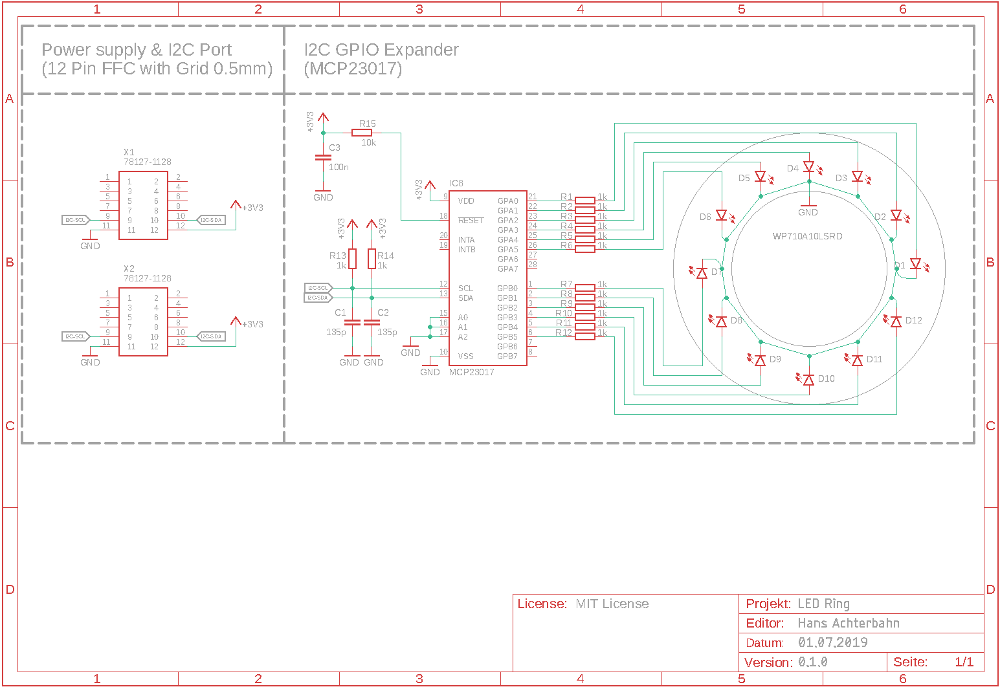
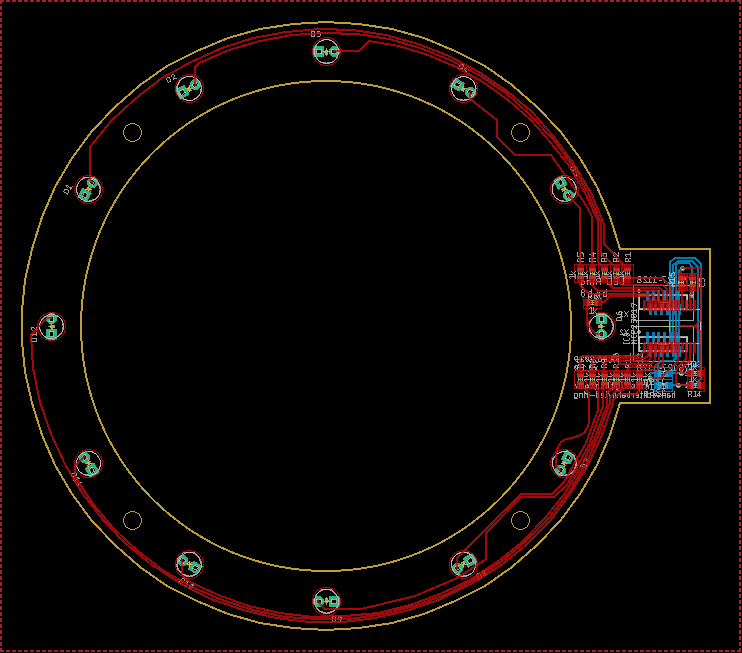

# LED Ring

A simple LED ring with twelve 3 mm LEDs and i2c interface. Created to use with a [CIRQUE TM035035 touch pad](https://www.cirque.com/glidepoint-circle-trackpads). Its 12 positions makes it suitable for clock applications.

I use this PCB in my [bottle-light](https://github.com/HansAchterbahn/bottle-light) project.

*Fork me and have fun!*

## Schematic

## Board

## 3D View (Fusion360)

