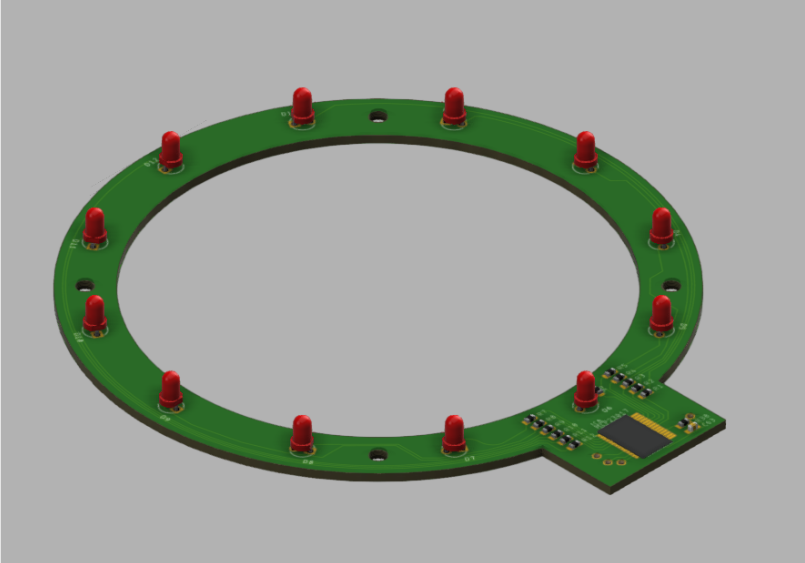
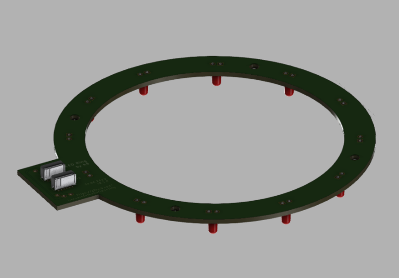

# LED Ring

A simple LED ring with i2c interface. Created to use with CIRQUE TM035035 touch pad. (https://www.cirque.com/glidepoint-circle-trackpads)

I use this PCB in my [bottle-light](https://github.com/HansAchterbahn/bottle-light) project.

